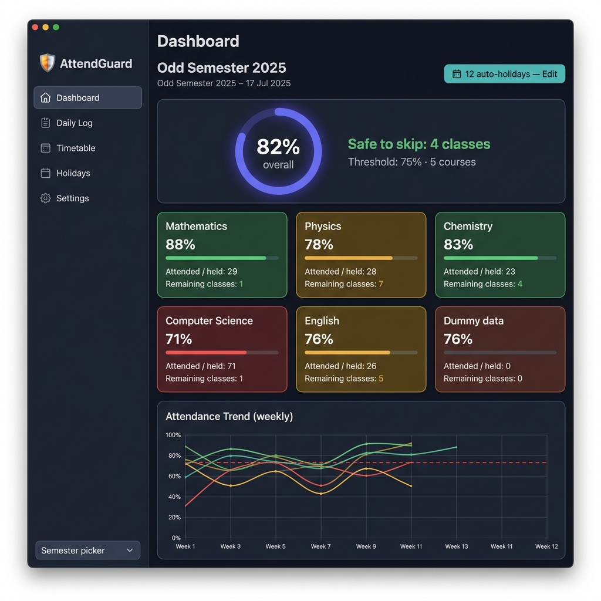
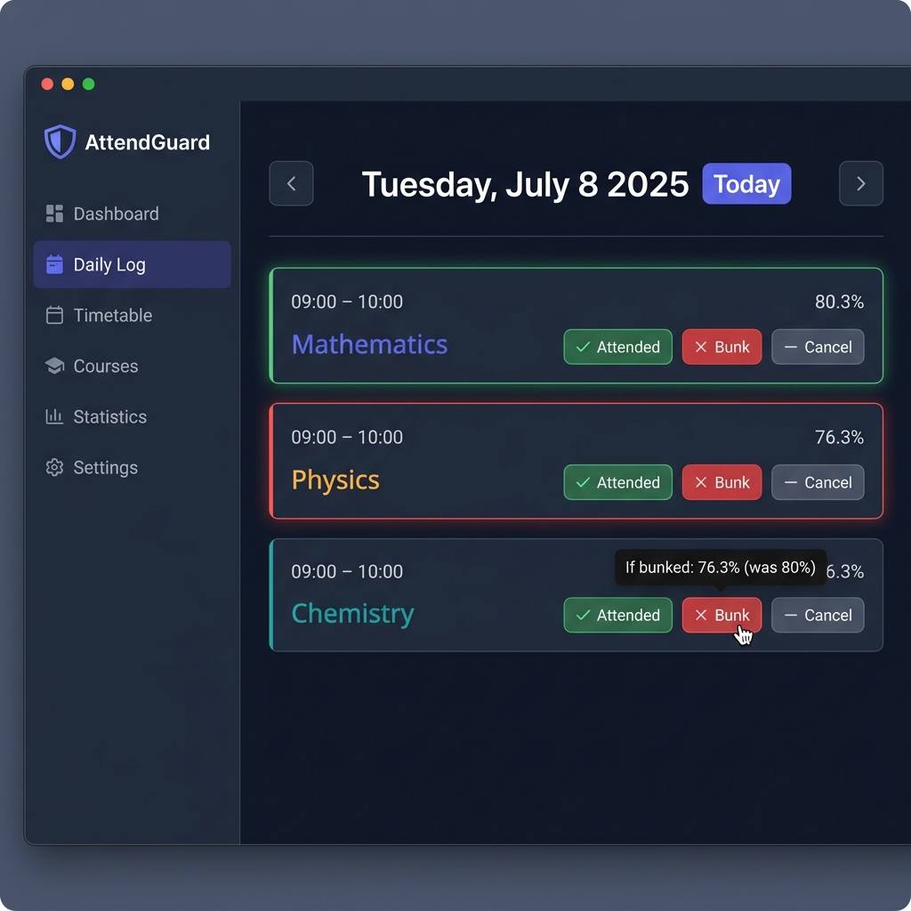

# AttendGuard 🛡️

**Desktop attendance tracker that projects your end-of-semester percentage in real time — so you always know exactly how many classes you can safely skip.**


---



*Dashboard — aggregate ring, per-course cards, and weekly attendance trend*

---

## Features

- **Real-time percentage projection** — see your current attendance %, best-case (attend all remaining), and worst-case (miss all remaining) simultaneously
- **Safe-skip calculator** — per course and in aggregate: "You can safely miss 4 more Physics classes before falling below 75%"
- **Bunk preview tooltip** — hover over the Bunk button to see the exact % drop *before* you commit
- **Daily Log** — date-navigable class-by-class log with Attended / Bunk / Cancelled status per slot
- **Timetable import** — drag-and-drop CSV or XLSX with row-level validation errors; or enter schedules manually
- **Holiday engine** — auto-generates public holidays for any semester date range; state-selectable (Tamil Nadu, Maharashtra, Karnataka, and 14 others); covers 2024–2030 with fixed holidays computed for any year
- **Multi-semester support** — store history with an `is_active` flag; switch semesters from the sidebar picker
- **Aggregate methods** — simple average (default) or credit-weighted toggle in Settings
- **Configurable threshold** — 75% default, adjustable per-semester and per-course; slider in Settings
- **Trend chart** — weekly attendance trend per course, with threshold reference line
- **100% local** — all data stored in SQLite on your machine; nothing leaves your device



*Daily Log — one-tap logging with live bunk-preview tooltip*

---

## Download

> Installers are published automatically on tagged releases via GitHub Actions.

| Platform | One-click download |
|----------|--------------------|
| 🪟 Windows | [**AttendGuard-Setup.exe**](https://github.com/SiddharthSeng/AttendGuard/releases/latest/download/AttendGuard-Setup.exe) |
| 🍎 macOS   | [**AttendGuard.dmg**](https://github.com/SiddharthSeng/AttendGuard/releases/latest/download/AttendGuard.dmg) |
| 🐧 Linux   | [**AttendGuard.AppImage**](https://github.com/SiddharthSeng/AttendGuard/releases/latest/download/AttendGuard.AppImage) · [AttendGuard.deb](https://github.com/SiddharthSeng/AttendGuard/releases/latest/download/AttendGuard.deb) |

---

## Getting Started

### Prerequisites

- **Node.js** >= 20 ([nodejs.org](https://nodejs.org))
- **npm** >= 10

### Install & Run

```bash
git clone https://github.com/SiddharthSeng/AttendGuard.git
cd AttendGuard
npm install       # installs deps + rebuilds native modules for Electron
npm run dev       # starts the app in development mode
```

### Build Installers

```bash
npm run build:win    # Windows NSIS installer
npm run build:mac    # macOS DMG (requires macOS)
npm run build:linux  # Linux AppImage + DEB
npm run dist         # all three (cross-platform CI)
```

### Run Tests

```bash
npm run test          # vitest (40 unit tests)
npm run typecheck     # TypeScript strict check
```

---

## Timetable Import Format

Drop a `.csv` or `.xlsx` file in the Timetable page. Required columns:

| Column | Example |
|--------|---------|
| `Course` | Engineering Mathematics |
| `Day` | Monday |
| `StartTime` | 09:00 |
| `EndTime` | 10:00 |

Optional: `Code` (e.g. `MA101`), `CreditHours` (default `1`)

---

## Holiday Engine

Auto-generation is India/Tamil Nadu-oriented by default but fully configurable:

- **State selector** in Settings (TN, MH, KA, KL, AP, TS, WB, DL, GJ, RJ, UP, MP, GA, and more)
- **Fixed-date holidays** (Republic Day, Independence Day, Gandhi Jayanti, Christmas, state-specific days) computed dynamically for any calendar year
- **Variable-date festivals** (Diwali, Pongal, Eid, Holi, Onam, etc.) from a lookup table covering **2024-2030**; a warning is shown for dates outside this range
- Named holidays always take priority over generic "Sunday"/"Saturday" on the same date
- All holidays are **fully editable** — regenerate, add, delete, or import from CSV at any time

---

## Tech Stack


| Layer | Technology |
|-------|-----------|
| Desktop shell | Electron 39 + electron-vite 5 |
| UI framework | React 19 + TypeScript 5 |
| Local database | SQLite via `better-sqlite3` v12 |
| Routing | react-router-dom v7 |
| Charts | Recharts v3 |
| Date math | date-fns v3 |
| File parsing | papaparse + @e965/xlsx |
| Validation | Zod |
| Tests | Vitest (40 tests, 0 failures) |

---

## Project Structure

```
src/
+-- main/               # Electron main process
|   +-- database.ts     # SQLite init + WAL mode + migrations
|   +-- ipc/            # IPC handlers (semesters, courses, attendance, holidays)
+-- preload/            # contextBridge -> window.attendGuard
+-- shared/
|   +-- types.ts        # TypeScript types shared between main + renderer
|   +-- holidayEngine.ts# Holiday generation (no browser APIs)
+-- renderer/src/
    +-- hooks/          # useAppData -- all React data hooks
    +-- lib/            # calculator.ts, parser.ts
    +-- pages/          # Dashboard, DailyLog, Timetable, Holiday, Settings
    +-- components/     # AggregateSummary, CourseCard, TrendChart, SetupModal
```

---

## License

[MIT](LICENSE) (c) 2025 [SiddharthSeng](https://github.com/SiddharthSeng)
